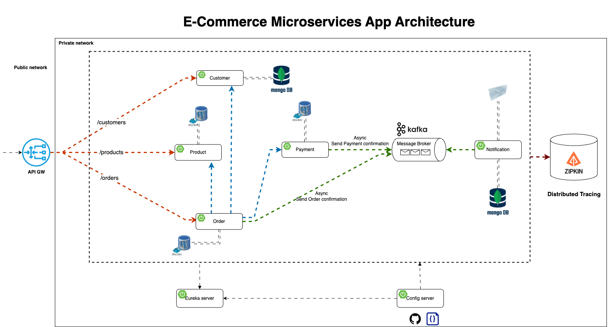

## Overview
This project is a comprehensive implementation of an e-commerce application backend using a microservices architecture. It is designed to streamline business operations by managing products, customers, orders, payments, and notifications. The application leverages various technologies to ensure scalability, efficiency, and maintainability.

## Business Needs
The application address the needs of a business owner in the e-commerce sector who seeks to:
- Manage a diverse product line
- Handle customer orders and payments efficiently
- Notify customers of payment statuses via email
- Enhance overall business operations and scalability through digital solutions

## Tools/Technologies Used 
- Java Spring Boot: Framework for building the microservices
- MongoDB, PostgreSQL: Databases for data storage
- Docker/Docker Compose: For containerization and orchestration
- Kafka: For asynchronous communication
- Eureka: For service discovery
- Zipkin: For distributed tracing
- API Gateway: Manages and routes API requests
- OpenFeign: For declarative REST client communication
- Spring Cloud Config: For centralized configuration management
- Keycloak: For securing the API Gateway

## Diagrams
The following diagram provides a better idea of the structure/architecture of the system:

## Modules
### Config Server
A centralized server for managing configurations of all microservices. It externalizes configuration properties and allows for dynamic updates without needing to restart the individual services.

### API Gateway
Acts as a public entry point for all client requests, routing them to the appropriate microservices. It enhances security, load balancing, and API management. The gateway is secured with Keycloak, which handles authentication and authorization, ensuring that only authenticated users can access the services. Keycloak integrates seamlessly with Spring Security to protect endpoints and manage secure communication between microservices.

### Customer Service
Manages customer data, including registration and retrieval. It interacts with the Config Server to fetch configuration settings and provides REST APIs for customer-related operations. 

Key Components:
- Customer entity and repository
- Customer registration and response DTOs
- Customer service and controller

### Product Service
Manages product data, including creation, update, and retrieval of product information. It ensures that product details are always up-to-date and accessible for order processing.

Key Components:
- Product entity and repository
- Product request and response DTOs
- Product service and controller

### Order Service
Handles the creation and management of orders. It communications with the Customer Service to validate customer information, the Product service to fetch important product information, and the Payment service to initialize the payment process. It also interacts with the OrderLine service as needed. 

Key components:
- Order entity and repository
- Order request and response DTOs
- Order service and controller
- OrderLine entity, service, repository, and controller
- Order producer, to produce Kafka messages to the "order" topic

### Payment Service
Processes payments for orders. It supports various payment methods and integrates with a notification system to inform customers of payment statuses. 

Key components:
- Payment entity and repository
- Payment request and response DTOs
- Payment service and controller
- Notification producer, to producer Kafka messages to the "payment" topic

### Notification Service
Sends email notifications to customers regarding their order and payment statuses. It consumes messages from Kafka queues and uses Java Mail for email delivery. 

Key components:
- Kafka consumer
- Email notification sender

### Discovery Service
Enables dynamic discovery of microservices with Eureka, allowing them to locate and communicate with each other without hardcoded addresses

## Other Details
Asynchronous communication is handled using Kafka to consume order and payment related messages and subsequently send confirmation emails to customers. This ensures decoupled and resilient communication. Distributed tracing is done through Zipkin to provide tracing capabilities to monitor and debug the flow of requests across microservices. I/O validation is performed with Spring's Hibernate Validator, and different type of exceptions are handled appropriately. 
